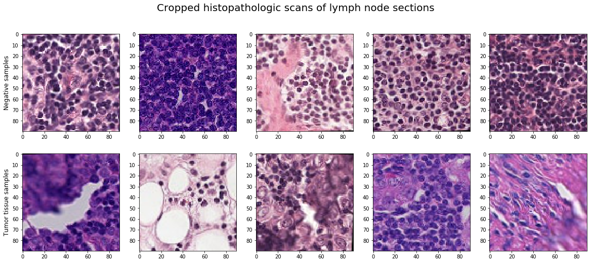
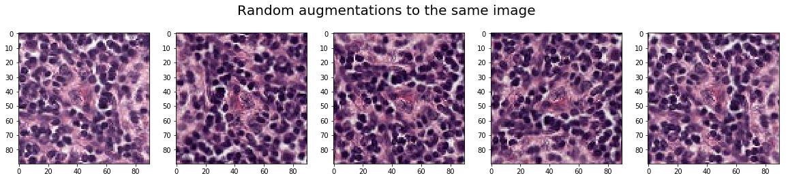
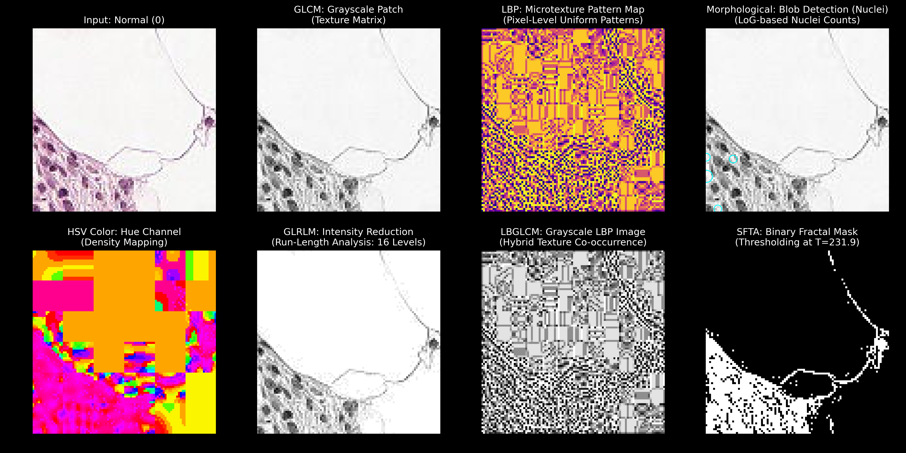
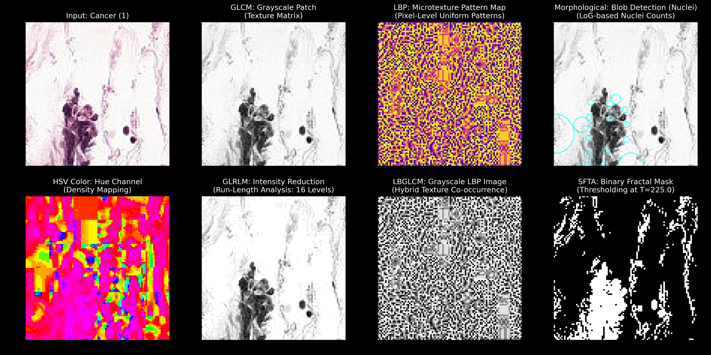
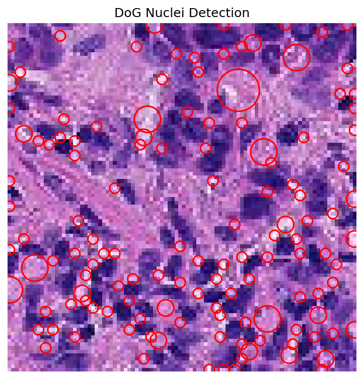
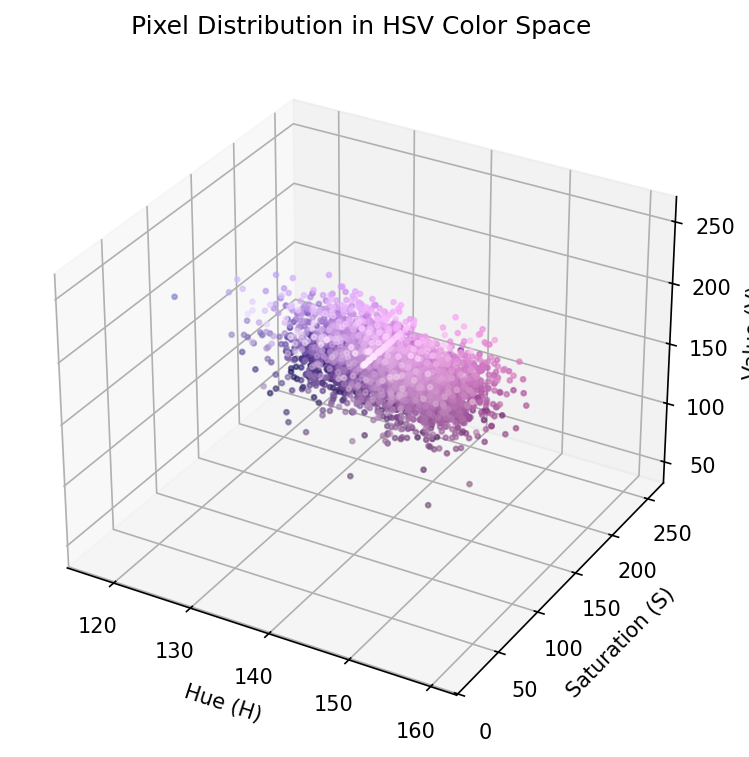
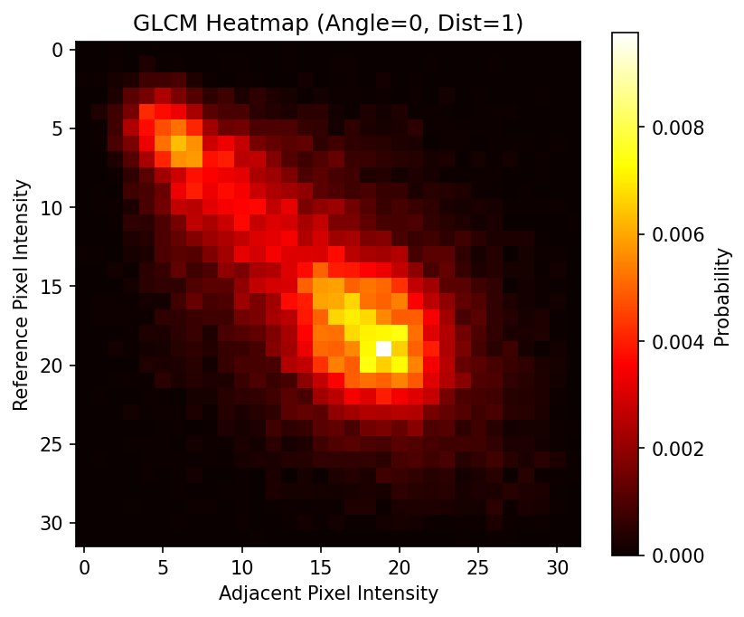
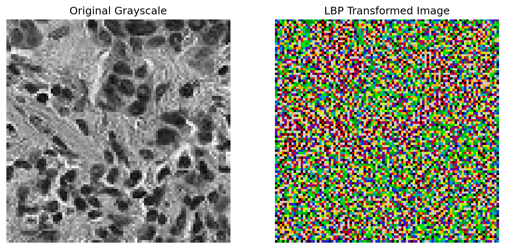
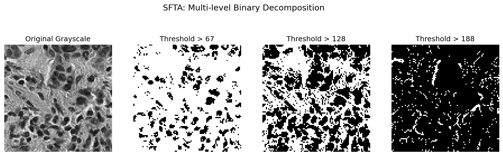

# Histopathologic Cancer Detection Pipeline

<div align="center">


[//]: # (![XGBoost]&#40;https://img.shields.io/badge/XGBoost-15C49A?style=for-the-badge&logo=xgboost&logoColor=white&#41;)


[//]: # (![SciPy]&#40;https://img.shields.io/badge/SciPy-%230C55A5.svg?style=for-the-badge&logo=scipy&logoColor=%white&#41;)

</div>

> An automated machine learning pipeline for extracting complex spatial, morphological, and textural features from digitized histopathology images to detect metastatic cancer.

---

## Table of Contents
* [Project Overview](#project-overview)
* [Dataset](#dataset)
* [Data Handling](#data-handling)
* [Feature Extraction Methodology](#feature-extraction-methodology)
* [Training Pipeline](#training-pipeline)
* [Model Performance](#model-performance)
* [Usage](#usage)

---

## Project Overview
The objective of this project is to automate the detection of metastatic cancer cells in small image patches extracted from larger digital pathology scans of lymph node sections. By translating raw Hematoxylin and Eosin (H&E) stained images into dense numerical representations, this pipeline leverages advanced computer vision algorithms and Classification model to identify malignant tissue characteristics.

---

## Dataset
The data for this project is a modified version of the PatchCamelyon (PCam) benchmark dataset, provided via Kaggle. It consists of small 96x96 pixel microscopic images of lymph node tissue sections.

The overarching task is binary classification: algorithms must predict whether the **center 32x32 pixel region** of a given patch contains at least one pixel of metastatic tumor tissue. The outer boundary region of the image is deliberately included to allow fully-convolutional models to process the tissue without relying on zero-padding, ensuring consistent behavior when applied to whole-slide images. Unlike the original PCam dataset, this specific iteration has been scrubbed of duplicate images.




---

## Feature Extraction Methodology

Rather than relying solely on abstract representations from deep neural networks, this pipeline explicitly calculates the underlying mathematical mechanics of the tissue's morphology and texture. 

### Visual Audit of Extracted Features
The grids below demonstrate how our pipeline transforms a standard H&E image into distinct mathematical spaces. Notice the structural chaos and high density in the malignant sample compared to the uniform structure of the normal sample.

**Normal (Healthy) Tissue:**


**Malignant (Cancer) Tissue:**


### The Mathematical Backbone
The `image_features.py` module extracts 7 distinct families of hand-crafted features, resulting in a 51-dimensional vector per image:

### 1. Difference of Gaussians (DoG)
DoG is an edge-enhancement algorithm used to detect blob-like structures, making it highly effective for isolating cell nuclei. It works by convolving the original image $I(x,y)$ with two 2D Gaussian kernels of differing standard deviations ($\sigma_1$ and $\sigma_2$) and subtracting the results:
$$D(x,y) = I(x,y) * G(x,y,\sigma_1) - I(x,y) * G(x,y,\sigma_2)$$
where $G(x,y,\sigma) = \frac{1}{2\pi\sigma^2} e^{-(x^2+y^2)/(2\sigma^2)}$. The pipeline extracts 11 spatial statistics from this output, including blob count and Euclidean distances between structures.

[//]: # ()
[//]: # ()

### 2. Color Statistics
To quantify staining variability and tissue density independently of illumination, the BGR image is transformed into the HSV (Hue, Saturation, Value) color space. Statistical moments are then computed for each channel $c$:
$$\mu_c = \frac{1}{N} \sum_{i=1}^{N} c_i$$
$$\sigma_c = \sqrt{\frac{1}{N} \sum_{i=1}^{N} (c_i - \mu_c)^2}$$

[//]: # ()

### 3. Gray-Level Co-occurrence Matrix (GLCM)
GLCM evaluates macro-texture by analyzing the spatial relationships of pixel intensities. It counts the frequency at which pairs of pixels with specific gray-level values ($i$ and $j$) occur adjacent to each other at a defined distance and angle. From the resulting normalized probability matrix $p(i,j)$, structural metrics like contrast are derived:
$$Contrast = \sum_{i,j} |i - j|^2 p(i,j)$$

[//]: # ()

### 4. Local Binary Patterns (LBP)
LBP is a micro-texture descriptor that labels every pixel by thresholding its circular neighborhood. For a center pixel $g_c$ and its $P$ neighbors $g_p$, a neighbor is assigned a 1 if its intensity is $\ge g_c$, and a 0 otherwise. These binary values are concatenated into a decimal value representing the local structural pattern:
$$LBP_{P,R} = \sum_{p=0}^{P-1} s(g_p - g_c) 2^p$$
where $s(x) = 1$ if $x \ge 0$, and $0$ otherwise.

[//]: # ()

### 5. Hybrid LBGLCM
This approach captures highly complex, second-order spatial-texture relationships. It first applies the LBP transformation to encode local micro-textures across the image array. Next, a GLCM matrix is computed *on top* of the LBP output, evaluating the macro-spatial relationships of those micro-textures ($GLCM(LBP(I))$).

### 6. Gray Level Run-Length Matrix (GLRLM)
GLRLM extracts directional patterns by assessing consecutive sequences (runs) of identical pixel values. The matrix $P(i,j)$ tallies the number of runs of gray level $i$ possessing a length of $j$. This yields metrics like Short Run Emphasis (SRE):
$$SRE = \frac{1}{N_r} \sum_{i,j} \frac{P(i,j)}{j^2}$$
where $N_r$ is the total number of runs.

### 7. Segmentation-based Fractal Texture Analysis (SFTA)
SFTA evaluates fractal dimensions by decomposing the image into binary layers via multi-level thresholding. It computes the area, mean, and standard deviation for the resulting regions, and evaluates boundary complexity using the box-counting fractal dimension $D_0$:
$$D_0 = \lim_{\epsilon \to 0} \frac{\log N(\epsilon)}{\log (1/\epsilon)}$$
where $N(\epsilon)$ is the number of boxes of side length $\epsilon$ required to cover the region boundary.

[//]: # ()

---

## Training Pipeline
The training architecture (`train.py`) utilizes a robust, scikit-learn-based pipeline designed for scalability and rigor for binary classification. 

### Preprocessing
1. **Dimensionality Expansion:** Numerical features are passed through `PolynomialFeatures` to capture non-linear, interactive relationships between the complex biological metrics.
2. **Scaling:** Data is standardized using `StandardScaler` (or optionally `MinMaxScaler`) to ensure uniform feature contribution.
3. **Categorical Handling:** Any categorical variables are parsed through a `OneHotEncoder`.

### Model Optimization
The pipeline currently evaluates **Random Forest Classifier**, **Support Vector Machines (SVR)**, and **eXtreme Gradient Boosting (XGBoost)**. Training is optimized through three available strategies:
* **Bypass Search:** Direct training using base parameters (fastest approach, standard configurations).
* **Randomized Search:** Rapid, stochastic exploration of the hyperparameter grid using cross-validation.
* **Bayesian Optimization:** Utilizes `skopt.BayesSearchCV` to efficiently navigate the hyperparameter space based on prior trial performance.

---

## Model Performance
The current production model utilizes a **Random Forest Classifier** trained directly on the base parameters. It was evaluated on a hidden test dataset comprising 20% of the total data.

### Current Best Results
* **Model:** Random Forest Classifier (Base Parameters)
* **Test Accuracy:** 0.8876
* **Test ROC AUC:** 0.9542

**Classification Report:**

| Class | Precision | Recall | F1-Score | Support |
| :--- | :--- | :--- | :--- | :--- |
| **0 (Normal)** | 0.89 | 0.92 | 0.91 | 26,182 |
| **1 (Cancer)** | 0.88 | 0.84 | 0.86 | 17,823 |
| **Accuracy** | | | **0.89** | 44,005 |
| **Macro Avg** | 0.89 | 0.88 | 0.88 | 44,005 |
| **Weighted Avg** | 0.89 | 0.89 | 0.89 | 44,005 |

*(Note: Configuration states are saved dynamically to `Config/model_config.yaml` and the optimal model is serialized to `Models/model_rf.pkl`.)*

---

## Usage

### 1. Feature Extraction
To run the extraction pipeline independently and generate the `.npz` dataset:
```bash
python data_handler.py \
    --csv "path/to/train_labels.csv" \
    --images "path/to/train/images" \
    --output_dir "Data/" \
    --features dog color glcm lbp lbglcm glrlm sfta \
    --samples -1 
```
*(Set `--samples` to a specific integer to test on a smaller subset, or `-1` for the full dataset).*

### 2. Model Training
To train the models using the extracted features and bypass the grid search to replicate the Random Forest results:
```bash
python train.py \
    --preprocessing StandardScaler \
    --Degree 1 \
    --bypass_search True \
    --save_model True
```